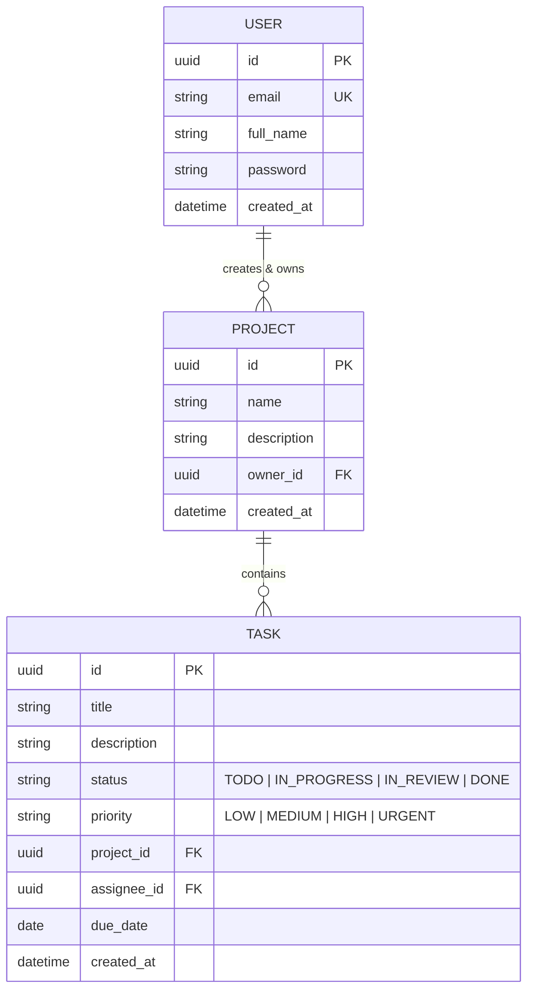

# ⚡ TaskFlow — Modern Task & Project Management Workspace

TaskFlow is a production-ready, high-performance, full-stack project and task management workspace. Built on top of a secure **Django REST Framework** API and a premium **React SPA** frontend, it features a fluid Kanban workflow, sleek glassmorphic layouts, and robust token-based authentication.

---

## 🎨 Premium User Experience & Aesthetics

TaskFlow is crafted to deliver a modern, visually stunning experience:
- **Glassmorphism & Gradients**: Premium dark mode theme utilizing rich HSL-curated colors, glowing graphical backdrops, and blur effects.
- **Micro-Animations & Transitions**: Fluid transitions for drag-and-drop state adjustments, button presses, and loading flows.
- **Responsive Layout**: Adapts gracefully across desktop monitors, laptops, tablets, and mobile screens.

---

## 🧠 System Architecture & Database Schema

TaskFlow adopts a highly modular structure. The relationship between core models is structured as follows:



---

## 📂 Project Structure

```
taskmanager/
├── backend/                  ← Django + DRF API Workspace
│   ├── manage.py
│   ├── requirements.txt
│   ├── .env.example
│   ├── config/               ← Global Settings (Dev, Base), URLs, WSGI
│   └── apps/
│       ├── users/            ← Custom User Model, JWT Authentication
│       ├── projects/         ← Project Models, Serializers, Views, and Perms
│       └── tasks/            ← Task Models, Kanban States, Filters, and Views
└── frontend/                 ← React + Vite SPA Workspace
    ├── package.json
    ├── vite.config.js
    └── src/
        ├── api/              ← Axios API client + endpoint interceptors
        ├── store/            ← Zustand global auth store
        ├── hooks/            ← TanStack React Query mutations & queries
        ├── pages/            ← Login, Register, Dashboard, Project Detail
        └── components/       ← ProtectedRoute, Navbar, KanbanBoard, Modals
```

---

## 🚀 Local Setup Guide

### 📋 Prerequisites
- **Python 3.11+**
- **Node.js 18+** & **npm 9+**
- **PostgreSQL 15+** (active and running locally)

---

### 1. Database Setup

Create a PostgreSQL database for the application:
```bash
# Connect to PostgreSQL and create database
psql -U postgres -c "CREATE DATABASE taskmanager;"
```

---

### 2. Backend Installation & Setup

1. **Navigate & Setup Environment**:
   ```bash
   cd backend
   python -m venv venv
   source venv/bin/activate  # On Windows: venv\Scripts\activate
   ```
2. **Install Dependencies**:
   ```bash
   pip install -r requirements.txt
   ```
3. **Configure Environment Variables**:
   ```bash
   cp .env.example .env
   ```
   Open the `.env` file and input your local PostgreSQL credentials:
   ```env
   SECRET_KEY=your-django-secret-key
   DEBUG=True
   DB_NAME=taskmanager
   DB_USER=postgres
   DB_PASSWORD=your_postgres_password
   DB_HOST=localhost
   DB_PORT=5432
   ```
4. **Run Database Migrations**:
   ```bash
   python manage.py makemigrations
   python manage.py migrate
   ```
5. **Create a Developer Superuser**:
   ```bash
   python manage.py createsuperuser
   # Input email and password when prompted
   ```
6. **Start Dev Server**:
   ```bash
   python manage.py runserver
   ```
   The backend API endpoints will be accessible at `http://127.0.0.1:8000/api/v1/`.

---

### 3. Frontend Installation & Setup

1. **Navigate & Install Packages**:
   ```bash
   cd ../frontend
   npm install
   ```
2. **Configure Environment Variables**:
   ```bash
   cp .env.example .env
   ```
   Make sure the `.env` matches the backend local endpoint:
   ```env
   VITE_API_URL=http://localhost:8000/api/v1
   ```
3. **Start Development Server**:
   ```bash
   npm run dev
   ```
   The application UI will run at `http://localhost:5173`.

---

## 🔒 Authentication & Security Architecture

TaskFlow implements standard **JWT (JSON Web Token)** authentication via `django-rest-framework-simplejwt`:
- **Access Tokens**: Loaded in-memory for security against XSS. Lifetime is set to `30 minutes`.
- **Refresh Tokens**: Saved securely in `localStorage` for session persistence. Lifetime is set to `7 days`.
- **Token Rotation**: Rotation configuration ensures that every time a token is refreshed, a new refresh token is issued, keeping user sessions safe and updated.

---

## 🔌 API Documentation Summary

### 🔑 Authentication (Public Endpoints)

| Method | Endpoint | Payload / Description |
| :--- | :--- | :--- |
| `POST` | `/api/v1/auth/register/` | Register with `full_name`, `email`, and `password` |
| `POST` | `/api/v1/auth/login/` | Sign in with `email` and `password` |
| `POST` | `/api/v1/auth/token/refresh/` | Refresh access token using `refresh` token |
| `GET` | `/api/v1/auth/me/` | Get current user's profile info (requires access token) |

### 📁 Projects (Authorization Header Required)

| Method | Endpoint | Description |
| :--- | :--- | :--- |
| `GET` | `/api/v1/projects/` | List all projects owned by the user |
| `POST` | `/api/v1/projects/` | Create a new project workspace |
| `GET` | `/api/v1/projects/:id/` | Retrieve specific project details |
| `PATCH` | `/api/v1/projects/:id/` | Update project name or description |
| `DELETE` | `/api/v1/projects/:id/` | Permanently delete a project |

### 📝 Tasks (Authorization Header Required)

| Method | Endpoint | Description |
| :--- | :--- | :--- |
| `GET` | `/api/v1/projects/:id/tasks/` | List all tasks assigned under a project |
| `POST` | `/api/v1/projects/:id/tasks/` | Create a task under a specific project |
| `GET` | `/api/v1/tasks/` | List user's tasks across all projects |
| `GET` | `/api/v1/tasks/:id/` | Fetch task details |
| `PATCH` | `/api/v1/tasks/:id/` | Update title, description, status, or priority |
| `DELETE` | `/api/v1/tasks/:id/` | Remove a task |

*Supported Task filters*: `?status=TODO|IN_PROGRESS|IN_REVIEW|DONE` and `?priority=LOW|MEDIUM|HIGH|URGENT`

---

## 🛠️ Verification & Testing

Verify both environments are fully functional using the following commands:
- **Backend Quality Check**:
  ```bash
  cd backend
  python manage.py check
  ```
- **Frontend Build Pipeline**:
  ```bash
  cd frontend
  npm run build
  ```
